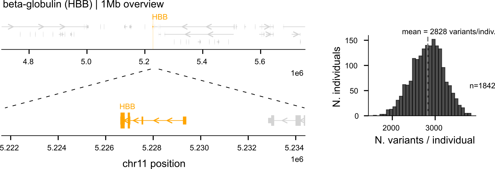
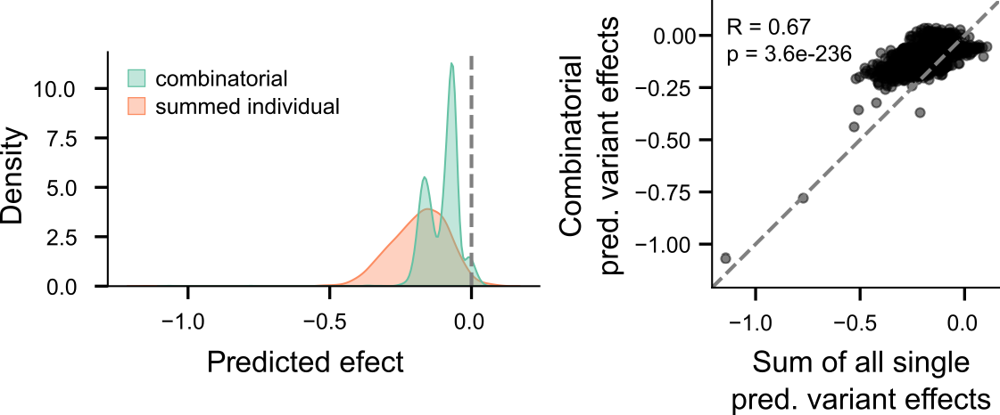
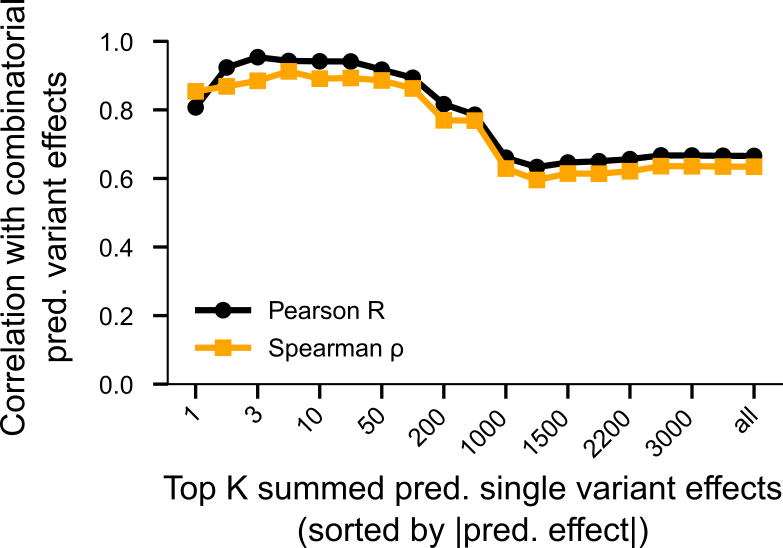
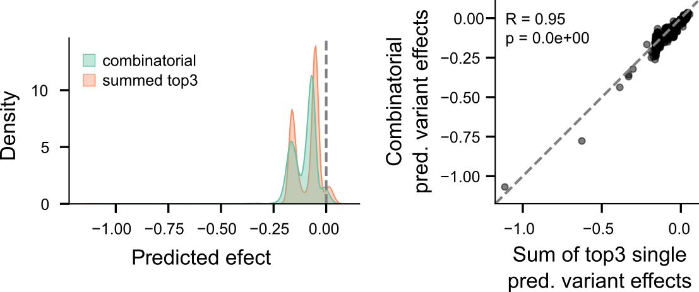
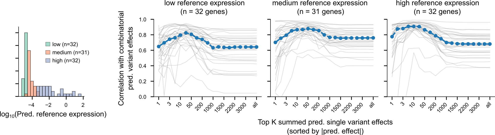


Sequence-to-function models such as AlphaGenome can predict the effects of individual genetic variants on gene expression, but personal genomes contain thousands of variants that must be interpreted together. How models combine these effects remains poorly understood and is relevant for personal genome prediction.

Here, we compared predictions from personalized sequences with sums of corresponding single-variant effects precomputed by the AlphaGenome Atlas. Surprisingly, the combined predictions were often well approximated by only a few of the strongest variants: for HBB, the top three single-variant effects reached a Pearson correlation of 0.95 with the full personalized-sequence prediction. A similar pattern held across the rest of the genes in the region.

The whole, it seems, is not the sum of all its parts, but rather the sum of a few strong ones. This suggests that personalized predictions may sometimes be approximated directly from precomputed single-variant scores, without needing to run the model on every personalized sequence.

Although this principle remains to be tested genome-wide, this experiment shows how genome-scale resources can help stress-test current models and expose the behaviors that should guide the next generation of personal genome predictors.


---

## From single variants to personal genomes

Sequence-to-function models can predict how genetic variants alter molecular phenotypes such as gene expression [1]. They perform particularly well when evaluating variants one at a time, but their predictions are substantially less reliable when applied to personal genomes containing many variants simultaneously [2,3]. Personal genomes do not contain variants one at a time: they contain thousands of differences from the reference genome. This raises a simple question with important consequences for personal-genome prediction: How does a model combine the effects of many variants in the same sequence?

At one extreme, the prediction for a sequence carrying many variants could simply equal the sum of the effects predicted for each variant independently. At the other, combinations of variants could produce substantial non-additive behavior, either because the underlying regulatory grammar is nonlinear or because heavily mutated sequences take the model away from the sequence distribution on which it was trained.

Testing this directly has traditionally been expensive. For each individual, one would need both a prediction for the complete personalized sequence and predictions for each of its variants in isolation. Genome-wide resources containing precomputed single-variant predictions can dramatically reduce this computational burden, making it possible to study how models behave on combinations of variants at population scale.

The release of the AlphaGenome Atlas [4] provides exactly such a resource. The Atlas contains precomputed AlphaGenome [5] predictions for single-nucleotide variants across the genome, so the expensive single-variant predictions no longer need to be generated from scratch. To compare individual and combined effects, we therefore only need to run new forward passes for the personalized sequences themselves.

Given AlphaGenome's state-of-the-art performance across many benchmarks, the AlphaGenome Atlas offers more than computational convenience: it provides an opportunity to systematically probe where sequence-to-function models behave as expected, and where they do not. This gave us an opportunity to ask whether AlphaGenome's prediction for thousands of variants together is more than the sum of its single-variant predictions.

## Our in silico experimental setup: a 1-Mb window around HBB

For this experiment, we focused on the 1-Mb genomic window containing HBB, which encodes the beta-globin subunit of hemoglobin.

We constructed personalized sequences for 1,842 individuals from the 1000 Genomes Project [6]. Within this 1-Mb window, each individual differed from the reference genome at an average of 2,828 variants (Fig. 1).

For every individual, we then compared two quantities:
- **Combined-variant prediction:** the AlphaGenome predicted change in expression obtained after introducing all of that individual's variants into the sequence simultaneously.
- **Summed single-variant prediction:** the sum of the gene expression effects predicted by AlphaGenome for those same variants individually, using scores from the AlphaGenome Atlas.

Although AlphaGenome provides predictions for thousands of output tracks, we focused on the GTEx whole-blood expression track, given the relevance of HBB to erythroid cells and blood.

## The sum of all parts is actually greater than the whole

The distributions of the two predictions look strikingly different. The combined-variant predictions form a multimodal distribution, whereas the sum of all single-variant effects produces a broader, smoother distribution (Fig. 2).

The two quantities are nevertheless correlated across individuals (Pearson correlation = 0.67), showing that the single-variant predictions contain substantial information about the personalized-sequence prediction. However, the summed single-variant effects are generally more extreme.

In other words, simply adding the predicted effect of every variant appears to overestimate the magnitude of AlphaGenome's combined-variant prediction. This suggests a different possibility: perhaps most variants contribute very little, and the combined prediction is dominated by only a small number of variants with large predicted effects.

## How many variants does AlphaGenome actually consider?

To test this, for each individual we ranked variants by the absolute magnitude of their predicted single-variant effect. We then progressively summed the top K variants and asked how well each partial sum reproduced the prediction obtained from the full personalized sequence (Fig. 3).

Using only the strongest few single-variant effects reproduces most of the variation in AlphaGenome's combined-variant predictions. Performance peaks very quickly and then declines as increasingly weaker variants are added to the sum.

Summing only the top three single-variant effects per individual produces a Pearson correlation of 0.95 with the full combined-variant prediction. The distribution of these top-three sums also closely resembles the multimodal distribution produced by the personalized sequence predictions (Fig. 4).

So, at least for HBB and this whole-blood output, AlphaGenome's prediction for a sequence containing thousands of variants can be approximated remarkably well using only a handful of its strongest single-variant predictions.

Importantly, this does not necessarily mean that AlphaGenome ignores the remaining variants internally. Rather, it tells us that, at the level of the final output, most of the predicted inter-individual variation can be captured by a sparse additive approximation.

## HBB does not seem to be a special case

HBB could of course be an unusual example. To determine whether this behavior generalizes within the same genomic window, we repeated the top-K analysis for the 95 genes for which we had sufficient predictions.

Across the 95 genes, correlations typically increase as the strongest variants are added, peaking around K=10-50 before declining as weaker variants are included (Fig. 5). Although the optimal K varies substantially between genes, the overall trend is consistent: AlphaGenome's combinatorial predictions are better approximated by a relatively small subset of strong single-variant effects than by summing all variants.

## The whole is the sum of some of its parts

So, for this experiment, apparently the whole is not greater than the sum of its parts. Instead, AlphaGenome's combined-variant prediction is remarkably well approximated by summing only a small number of variants with the strongest predicted individual effects.

That observation has a practical consequence. If the goal is simply to approximate what AlphaGenome would predict for a personalized sequence, it may not always be necessary to run a new model inference on that sequence. For HBB, summing only the three strongest single-variant effects from the AlphaGenome Atlas already comes remarkably close.

Whether this approximation holds across genes, cell types, regulatory contexts, and different classes of genetic variation remains to be tested. More importantly, the cases in which it fails may ultimately be the most interesting, as they could reveal genuinely non-additive behavior. A further limitation is that the code used to generate the AlphaGenome Atlas is not publicly available yet, so we cannot confirm that the single-variant scores were computed using exactly the same gene-expression scoring procedure implemented in the public AlphaGenome repository.

Resources such as the AlphaGenome Atlas make experiments like this much easier. Beyond providing individual variant scores, they offer a systematic way to stress-test current sequence-to-function models, identify where their assumptions break down, and use those failures to guide the development of the next generation of more robust models that better capture the regulatory code underlying transcription and ultimately enable reliable personal-genome inference.

## Reproducibility

The repository [wigttsoip](https://github.com/DiasFrazerGroup/wigttsoip) contains all the necessary code, from data downloading to analysis and figures, to reproduce these results.

## References

1. Nagai, M., Murphy, A.E., Rizzo, K. & Koo, P.K. Toward generalizable and interpretable AI in regulatory genomics., Nature Genetics (2026). https://doi.org/10.1038/s41588-026-02670-3
2. Drusinsky, S., Whalen, S. & Pollard, K.S. Deep-learning prediction of gene expression from personal genomes., Genome Biology (2026). https://doi.org/10.1186/s13059-025-03926-7
3. Drusinsky, S. & Pollard, K.S. Causal variant underestimation is a major overlooked driver of sequence-to-function model underperformance., bioRxiv (2026). https://doi.org/10.64898/2026.09.08.750172
4. DeepMind. AlphaGenome Atlas: a predictive map of every possible DNA letter change in the human genome. (2026). https://deepmind.google/blog/alphagenome-atlas-a-predictive-map-of-every-possible-dna-letter-change-in-the-human-genome/
5. Avsec, Ž. et al. Advancing regulatory variant effect prediction with AlphaGenome., Nature (2026). https://doi.org/10.1038/s41586-025-10014-0
6. Byrska-Bishop, M. et al. High-coverage whole-genome sequencing of the expanded 1000 Genomes Project cohort including 602 trios., Cell (2022). https://doi.org/10.1016/j.cell.2022.08.004

## Contributions
- Miquel Anglada-Girotto and Federico Billeci contributed equally to this work.
- Jonathan Frazer and Mafalda Dias jointly supervised this work.

## Acknowledgements

We acknowledge support of the Spanish Ministry of Science and Innovation through the Centro de Excelencia Severo Ochoa (CEX2020-001049-S, MCIN/AEI /10.13039/501100011033), and the Generalitat de Catalunya through the CERCA programme, and to the EMBL partnership. We are grateful to the CRG Core Technologies Programme for their support and assistance in this work.
