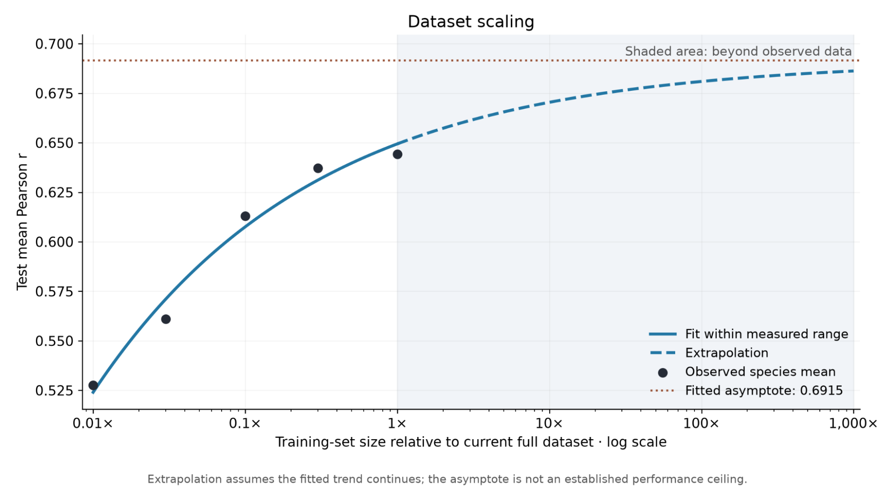
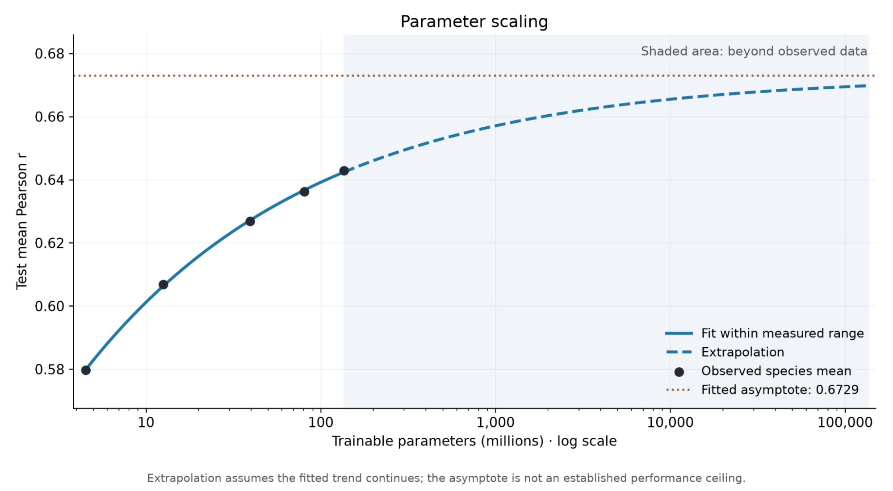
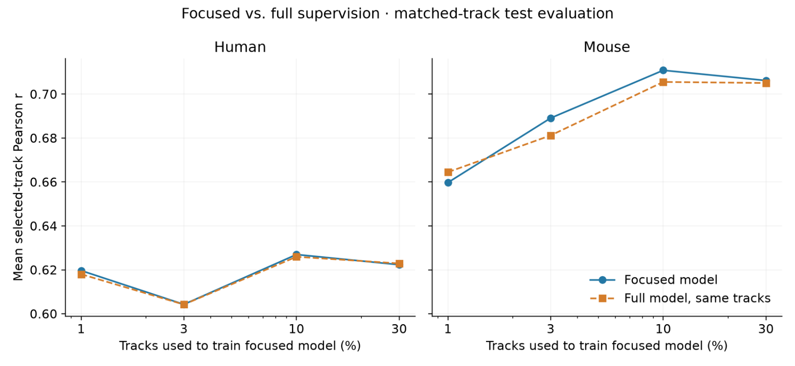
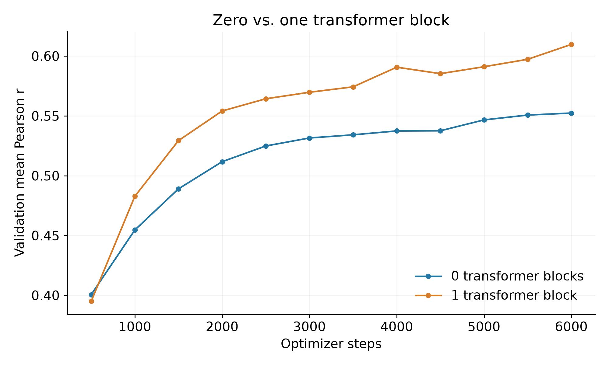
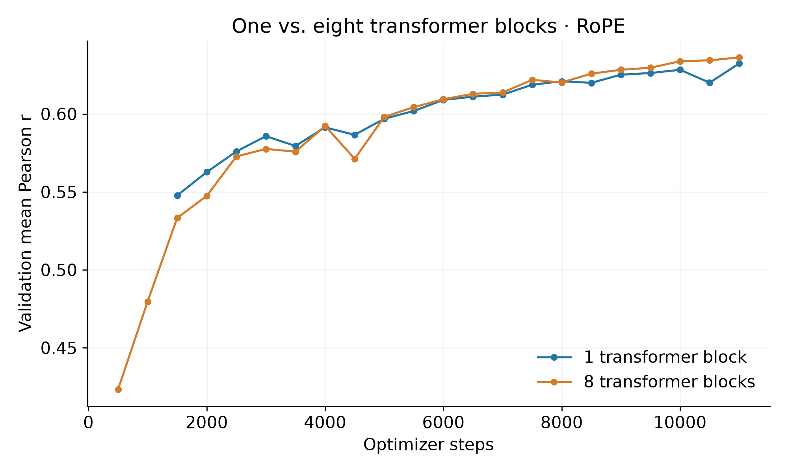
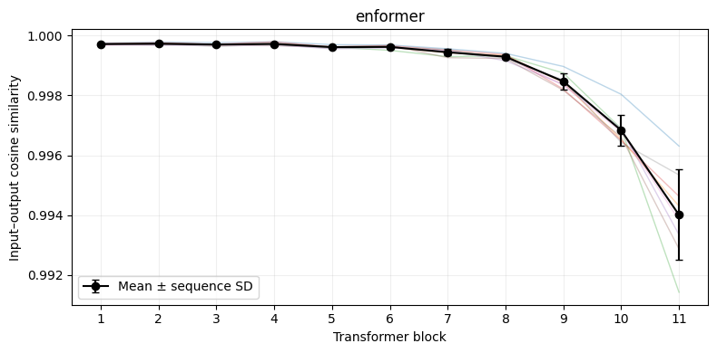
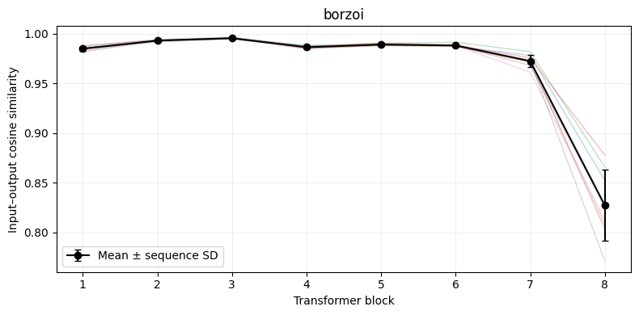
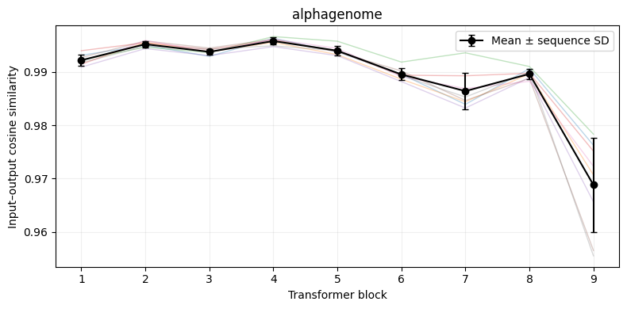



In this post, I explore how sequence-to-omics (S2O, a.k.a. sequence-to-function) models scale across three axes: dataset breadth, parameter count, and track diversity. I find that adding more data or parameters yields diminishing returns, while adding more tracks provides no consistent benefit. I also show that a model with just one transformer block can reach similar validation performance to an eight-transformer model at matched training steps.

**Highlights**

- Power-law fits estimate asymptotic performance of approximately 0.692 mean Pearson for dataset scaling and 0.673 for parameter scaling, just 0.047 and 0.030 higher than their respective baselines.
- A one-transformer model reaches similar performance to an eight-transformer model (0.6324 vs. 0.6363 validation mean Pearson, respectively, using RoPE at 11,000 steps).
- These are extrapolations conditional on the fitted curves, and shouldn’t be treated as established performance ceilings.

Code: [https://github.com/jsomeara/sequence-to-omics-scaling](https://github.com/jsomeara/sequence-to-omics-scaling)

See Run Data: [https://johnomeara.com/s2o-scaling-runs-viewer](https://johnomeara.com/s2o-scaling-runs-viewer)



## Scaling Dataset Breadth

To evaluate how accuracy scales with **dataset breadth**, I ran five training experiments, each exposed to a different number of randomly selected sequence windows from the Enformer/Basenji2 dataset ([1](#ref-1)–[5](#ref-5)). All experiments ran for 10,000 steps. Both human and mouse tracks were used. A basic CNN + Transformer architecture was used.

Here are the results:

$$\widehat{\bar r}=0.69153584-0.04211544f^{-0.29979405}.$$

Here $f$ is the training fraction (0.01–1.00). In-sample RMSE: 0.006473 Pearson units.

| Proportion | Paired examples | Unique human windows | Unique mouse windows | Human test Pearson | Mouse test Pearson | Mean test Pearson |
| --- | --- | --- | --- | --- | --- | --- |
| 1% | 340 | 340 | 340 | 0.488453 | 0.566707 | 0.527580 |
| 3% | 1,021 | 1,021 | 1,017 | 0.524498 | 0.597414 | 0.560956 |
| 10% | 3,402 | 3,402 | 3,350 | 0.567636 | 0.658549 | 0.613093 |
| 30% | 10,206 | 10,206 | 9,792 | 0.588144 | 0.686380 | 0.637262 |
| 100% | 34,021 | 34,021 | 29,295 | 0.593640 | 0.694865 | 0.644252 |

These results suggest that simply training on more sequence windows from these datasets yields diminishing improvements under the same training budget. Increasing the training subset from 30% to 100% improved mean test Pearson by only 0.007. The fitted scaling curve equation suggests that there *may* be an architectural limit to performance irrespective of data amount. However, because of the limited sample size (n = 5), we ought to be wary of jumping to conclusions prematurely.

It’s tempting to hypothesize that data from other species might introduce useful new patterns. While these experiments cannot directly answer that question, the diminishing gains from additional human and mouse data make me skeptical that simply adding more species would yield large improvements. Still, evolutionary diversity could provide information that more windows from the same species do not, so this remains a very valid hypothesis to test.

## Scaling Parameter Count

To evaluate how accuracy scales with **model size**, I ran five training experiments, each with varying parameter count. Notably, all models used just one transformer block ([see why](#transformer-gains-are-somewhat-limited)). All models had equal training steps under exactly the same dataset (Enformer/Basenji2) and random seed.

Here are the results:

$$\widehat{\bar r}=0.67294824-0.15264392\left(P/10^6\right)^{-0.32762420}.$$

Here $P$ is the number of trainable parameters. In-sample RMSE: 0.000400 Pearson units.

| Model | Parameters | Human test Pearson | Mouse test Pearson | Mean test Pearson |
| --- | --- | --- | --- | --- |
| tiny | 4,515,288 | 0.528962 | 0.630330 | 0.579646 |
| small | 12,571,768 | 0.556101 | 0.657543 | 0.606822 |
| medium | 39,402,936 | 0.576619 | 0.676999 | 0.626809 |
| large | 80,525,048 | 0.585248 | 0.687223 | 0.636236 |
| full | 135,938,104 | 0.591996 | 0.693784 | 0.642890 |

These results show a similar pattern to dataset scaling: larger models perform better, but the gains become smaller as parameter count increases. Increasing the model from 39.4 million to 135.9 million parameters (more than triple the size) improved mean test Pearson by only 0.016. The fitted curve suggests further diminishing returns, although it's unclear whether its asymptote should be interpreted as a hard architectural limit. Still, it seems that simply adding parameters is a less compelling direction than finding architectures that use those parameters more effectively.

## Scaling Track Diversity

To evaluate how accuracy scales with **track diversity**, I ran another five training experiments, each exposed to a subset of randomly selected tracks from the Enformer/Basenji2 dataset. In performing these experiments, I sought to answer not only the scaling question, but also learn whether focus on *specific tracks* or data diversity across *many tracks* was more advantageous. In these runs, neither approach had a clear advantage: results on each subset were approximately the same between focused models and the all-track model.

*For each subset, both models were evaluated on exactly the same selected tracks. Pearson was calculated separately for each track across test examples and sequence bins, then averaged over tracks with defined correlations in both models.*

| Track fraction | Species | Selected tracks | Focused Pearson | Full-model Pearson, same tracks | Δ focused − full |
| --- | --- | --- | --- | --- | --- |
| 1% | Human | 53 | 0.619670 | 0.618029 | +0.001640 |
| 1% | Mouse | 16 | 0.659757 | 0.664492 | -0.004735 |
| 3% | Human | 159 | 0.604273 | 0.604211 | +0.000062 |
| 3% | Mouse | 49 | 0.689113 | 0.681215 | +0.007898 |
| 10% | Human | 531 | 0.626970 | 0.625954 | +0.001015 |
| 10% | Mouse | 164 | 0.710858 | 0.705554 | +0.005304 |
| 30% | Human | 1594 | 0.622344 | 0.622931 | -0.000587 |
| 30% | Mouse | 493 | 0.706207 | 0.705071 | +0.001136 |

These results suggest that more tracks do not necessarily lead to better predictions on a given subset. Whether additional supervision helps may depend on which tracks are added.

One limitation is that I only ran one trial per subset size. Ideally, I would have repeated these experiments, especially for smaller subsets like 1%, but compute limitations prevented this. Still, the differences in this trial were small and did not consistently favor either approach. Thus, naively scaling track diversity does not seem like a very viable option for increased performance.

## Transformer Gains are Somewhat Limited

In current architecture designs, attention is helpful, but only to a limited extent. In my testing, I saw a very clear increase in performance between a model with *zero* transformer blocks and a model with just one:

However, going past one transformer block did not improve performance dramatically:

**Data Summary:**

| Positional encoding | Blocks | Matched step | Human validation Pearson | Mouse validation Pearson | Mean validation Pearson |
| --- | --- | --- | --- | --- | --- |
| Original | 0 | 6,000 | 0.499523 | 0.605167 | 0.552345 |
| Original | 1 | 6,000 | 0.560605 | 0.658851 | 0.609728 |
| Original | 8 | 6,000 | 0.551344 | 0.651899 | 0.601622 |
| RoPE | 1 | 6,000 | 0.560593 | 0.657451 | 0.609022 |
| RoPE | 8 | 6,000 | 0.560375 | 0.658521 | 0.609448 |
| RoPE | 1 | 11,000 | 0.581557 | 0.683154 | 0.632356 |
| RoPE | 8 | 11,000 | 0.584142 | 0.688364 | 0.636253 |

To explore how much each transformer block changes its input, I perform a simple analysis of three common S2O models: Enformer ([1](#ref-1)), Borzoi ([6](#ref-6)), and AlphaGenome ([8](#ref-8)). For each block, I measure the cosine similarity between its input and output feature vectors at each sequence position, then average across positions and eight genomic sequences. Lower similarity means that the block changes the direction of these vectors more, while higher similarity means that their direction remains largely unchanged.

Here are the results:

Across all three models, the largest changes to the input representations tend to occur in the final transformer blocks, while earlier blocks make smaller changes. It is important to note that these measurements describe representation changes but do not establish whether individual blocks can be removed without affecting predictions. Separately, in the custom-model depth comparison, one and eight transformer blocks achieved similar validation Pearson scores at matched training steps. That result suggests a limited benefit from additional depth under the tested conditions, but does not fully establish that transformer blocks in Enformer, Borzoi, or AlphaGenome are redundant.

In short, it seems that some S2O models might be able to achieve similar performance with fewer transformer blocks.

## Methods

This is a very brief methods summary. Full details can be found in the [repository code](https://github.com/jsomeara/sequence-to-omics-scaling).

The custom model takes one-hot encoded DNA sequences of 131,072 bases as input. A multi-scale convolutional stem captures local sequence patterns, followed by six convolutional stages that progressively increase feature width and downsample the sequence to 128-base resolution. Six residual blocks with dilated convolutions provide broader sequence context, followed by one transformer block with 12 attention heads and a learned relative positional bias. The resulting features are cropped to the central 896 bins and passed through a pointwise projection and separate human and mouse output heads, which use Softplus activations to predict nonnegative signals for 5,313 human tracks and 1,643 mouse tracks. For parameter scaling, convolutional and transformer widths were varied together while layer counts and output dimensions remained fixed.

I trained models on human and mouse data from the Enformer/Basenji2 dataset, varying the fraction of training sequence windows, model width, or fraction of supervised tracks. Each configuration used one training seed. Within each sweep, models used matched training-step budgets, with validation and test splits held fixed. Dataset and parameter scaling were evaluated using test Pearson correlations, reported separately for each species and averaged equally across species. For track supervision, focused and full-track models were evaluated on exactly the same selected tracks, calculating Pearson correlation per track across pooled test examples and sequence bins before averaging over tracks with defined correlations in both models.

I fitted three-parameter power-law curves to the dataset and parameter scaling results using unweighted nonlinear least squares; their asymptotes are conditional extrapolations, not established performance ceilings. Transformer-depth comparisons varied the number of blocks and positional encoding, using validation Pearson correlations at matched training steps. Separately, I measured input–output cosine similarity for each transformer block in Enformer, Borzoi, and AlphaGenome across eight genomic sequences. This measures changes in representation direction, rather than whether a block is necessary. These exploratory experiments do not include repeated-seed uncertainty estimates or establish performance after training to convergence.

## Conclusion

Across these experiments, adding more sequence windows or parameters improved performance, but with diminishing returns. Adding more tracks provided no consistent benefit, and a model with just one transformer block performed similarly to an eight-block model. These experiments are limited by the small number of runs and lack of repeated trials, so they do not establish universal limits for S2O models. Still, they make me skeptical that simply scaling the same architectures and datasets is the most promising path forward.

I think these results highlight the need for new architectures and approaches in sequence-to-omics modeling. As a community, we should place more value on new ideas instead of focusing so heavily on scaling existing models. I invite others to challenge the assumptions behind current architectures and explore different ways to approach these problems. There is still a lot of room for progress, and I suspect some of the biggest improvements will come from ideas we have yet to try.



I’m a first-year undergraduate at the University of Washington with a strong interest in genomics and AI. I’ve been pursuing this work independently, and I’d love the opportunity to contribute to a research group and learn from experienced researchers. If you’re a professor or graduate student whose research overlaps with these interests, I’d be incredibly grateful for the chance to discuss opportunities to get involved. You can reach me at [jsomeara@uw.edu](mailto:jsomeara@uw.edu).



## References

1. Avsec, Ž. et al. Effective gene expression prediction from sequence by integrating long-range interactions. *Nature Methods* **18**, 1196–1203 (2021). [doi:10.1038/s41592-021-01252-x](https://doi.org/10.1038/s41592-021-01252-x).
2. Kelley, D. R. Cross-species regulatory sequence activity prediction. *PLOS Computational Biology* **16**, e1008050 (2020). [doi:10.1371/journal.pcbi.1008050](https://doi.org/10.1371/journal.pcbi.1008050).
3. yangyz1230. *space*: HDF5-formatted human and mouse Basenji data. Hugging Face dataset release. [Dataset and documentation](https://huggingface.co/datasets/yangyz1230/space) (accessed September 30, 2026).
4. Kelley, D. R. et al. Sequential regulatory activity prediction across chromosomes with convolutional neural networks. *Genome Research* **28**, 739–750 (2018). [doi:10.1101/gr.227819.117](https://doi.org/10.1101/gr.227819.117).
5. Yang, Z., Zhu, J. & Su, B. SPACE: Your Genomic Profile Predictor is a Powerful DNA Foundation Model. *Proceedings of the 42nd International Conference on Machine Learning* (2025). [Paper](https://openreview.net/forum?id=o4L9y4Jetm).
6. Linder, J. et al. Predicting RNA-seq coverage from DNA sequence as a unifying model of gene regulation. *Nature Genetics* **57**, 949–961 (2025). [doi:10.1038/s41588-024-02053-6](https://doi.org/10.1038/s41588-024-02053-6).
7. Su, J. et al. RoFormer: Enhanced transformer with Rotary Position Embedding. *Neurocomputing* **568**, 127063 (2024). [doi:10.1016/j.neucom.2023.127063](https://doi.org/10.1016/j.neucom.2023.127063).
8. Avsec, Ž. et al. Advancing regulatory variant effect prediction with AlphaGenome. *Nature* **649**, 1206–1218 (2026). [doi:10.1038/s41586-025-10014-0](https://doi.org/10.1038/s41586-025-10014-0).
